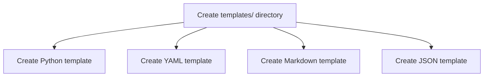
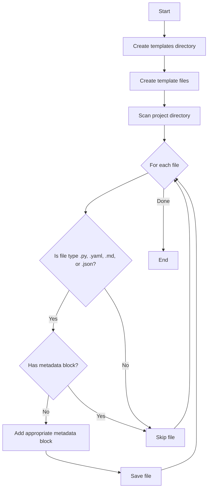
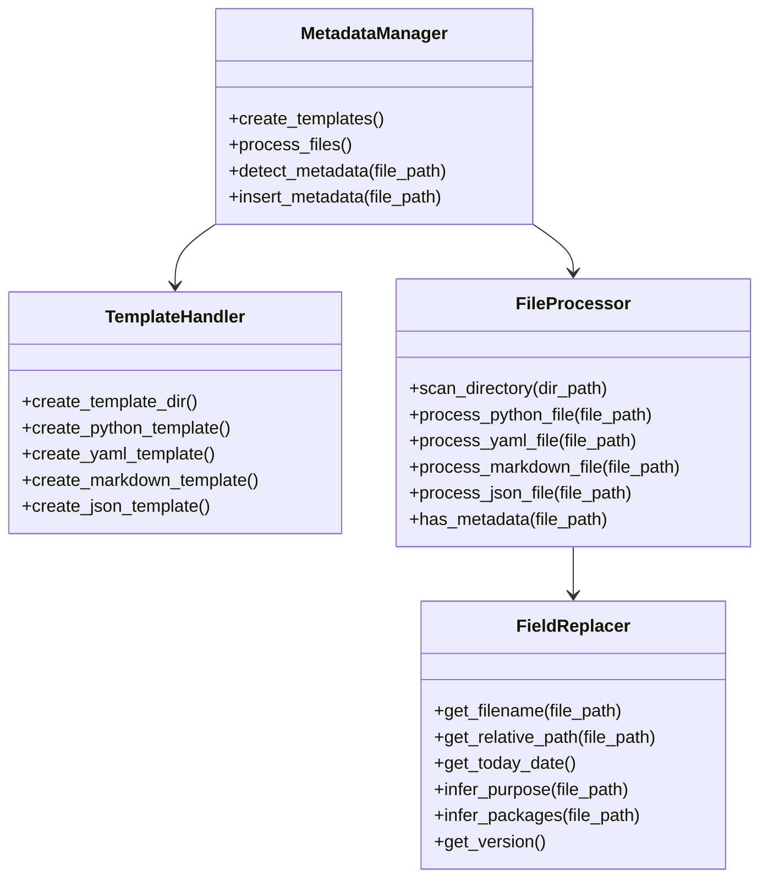

# Implementierungsplan: MCP Metadaten-Struktur

## 1. Überblick

Dieser Plan beschreibt die Schritte zur Implementierung einer vollständigen Metadaten-Struktur für alle relevanten Dateitypen (.py, .yaml, .md, .json) im MCP-Projekt, gemäß den Spezifikationen in der structure.rules.yaml-Datei.

## 2. Template-Erstellung

Zuerst erstellen wir das Templates-Verzeichnis und die Template-Dateien für jeden Dateityp:



### 2.1 Python Template (templates/script_metadata.template)

```python
# 📄 Script: {filename}
# 🔧 Zweck: {purpose}
# 🗂 Pfad: {relative_path}
# 👤 Autor: MINT-RESEARCH
# 📅 Erstellt: {today}
# 🧱 Benötigte Pakete: {packages}
# 🧪 Testbar: ❌

```

### 2.2 YAML Template (templates/yaml_metadata.template)

```yaml
# 📄 Datei: {filename}
# 🔧 Zweck: {purpose}
# 👤 Autor: MINT-RESEARCH
# 📅 Erstellt: {today}
# 📘 Gültigkeit: required
# 🧱 Version: {version}

```

### 2.3 Markdown Template (templates/markdown_metadata.template)

```markdown
<!-- 
📄 Datei: {filename}
🔧 Zweck: {purpose}
👤 Autor: MINT-RESEARCH
📅 Erstellt: {today}
📘 Typ: Dokumentation
-->

```

### 2.4 JSON Template (templates/json_metadata.template)

```json
{
  "_meta": {
    "file": "{filename}",
    "purpose": "{purpose}",
    "author": "MINT-RESEARCH",
    "created": "{today}",
    "version": "{version}"
  }
```

## 3. Dateiverarbeitungs-Algorithmus



## 4. Implementierungsschritte

1. **Templates-Verzeichnis und Dateien erstellen**
   - Erstellen des `templates/`-Verzeichnisses im Projektstamm
   - Erstellen der Template-Dateien mit den oben angegebenen Formaten

2. **Dateiscanner entwickeln**
   - Rekursives Scannen des Projektverzeichnisses
   - Identifizieren von Dateien mit den Erweiterungen .py, .yaml, .md und .json
   - Prüfen, ob jede Datei bereits einen Metadaten-Block hat
   - Für Dateien ohne Metadaten, Vorbereitung zum Hinzufügen des entsprechenden Templates

3. **Metadaten-Einfügelogik**
   - Für jeden Dateityp die entsprechende Einfügemethode implementieren:
     - Python/YAML: Zeilenkommentare am Anfang einfügen
     - Markdown: Blockkommentar am Anfang einfügen
     - JSON: _meta-Objekt als erstes Feld einfügen

4. **Dynamische Feldersetzung**
   - Ersetzen von Template-Platzhaltern durch tatsächliche Werte:
     - `{filename}`: Aus Dateipfad extrahieren
     - `{relative_path}`: Relativ zum Projektstamm berechnen
     - `{today}`: Aktuelles Datum im Format YYYY-MM-DD generieren
     - `{purpose}`: Basierend auf Dateiort/Name generieren
     - `{packages}`: Für Python-Dateien, versuchen aus Imports zu extrahieren oder Platzhalter verwenden
     - `{version}`: "1.0.0" als Standard verwenden

5. **Metadaten-Erkennungslogik**
   - Python/YAML: Auf Kommentarzeilen prüfen, die mit "# 📄" beginnen
   - Markdown: Auf Blockkommentar prüfen, das "📄 Datei:" enthält
   - JSON: Auf "_meta"-Feld auf oberster Ebene prüfen

## 5. Code-Struktur



## 6. Teststrategie

1. **Unit-Tests**
   - Testen der Metadaten-Erkennung für jeden Dateityp
   - Testen der Template-Erstellung
   - Testen der Feldersetzung

2. **Integrationstests**
   - Testen des kompletten Workflows an einem Beispielverzeichnis
   - Überprüfen, dass Dateien mit vorhandenen Metadaten nicht verändert werden
   - Überprüfen, dass die richtigen Metadaten zu Dateien ohne Metadaten hinzugefügt werden

3. **Manuelle Überprüfung**
   - Visuelle Inspektion einer Stichprobe von verarbeiteten Dateien, um die korrekte Formatierung sicherzustellen
   - Überprüfen, dass die Metadaten-Blöcke den Spezifikationen in structure.rules.yaml entsprechen

## 7. Implementierungszeitplan

1. **Phase 1: Setup (30 Minuten)**
   - Templates-Verzeichnis erstellen
   - Template-Dateien erstellen

2. **Phase 2: Kernimplementierung (1-2 Stunden)**
   - Dateiscanner entwickeln
   - Metadaten-Erkennung implementieren
   - Metadaten-Einfügung implementieren

3. **Phase 3: Testen und Verfeinern (1 Stunde)**
   - Testen an Beispieldateien
   - Implementierung basierend auf Testergebnissen verfeinern

4. **Phase 4: Vollständige Bereitstellung (30 Minuten)**
   - Ausführung auf dem gesamten Projekt
   - Ergebnisse überprüfen

## 8. Potenzielle Herausforderungen und Lösungen

1. **Herausforderung**: Dateien mit nicht-standardmäßiger Kodierung
   - **Lösung**: Kodierungserkennung hinzufügen und nur UTF-8 behandeln

2. **Herausforderung**: Vorhandene Metadaten in anderem Format
   - **Lösung**: Erkennung verbessern, um verschiedene Metadaten-Formate zu erkennen

3. **Herausforderung**: Große Dateien, die langsam zu verarbeiten sein könnten
   - **Lösung**: Dateilesen/-schreiben für große Dateien optimieren

4. **Herausforderung**: Bestimmen des geeigneten Zwecks für jede Datei
   - **Lösung**: Dateiort und -name verwenden, um den Zweck abzuleiten, mit Rückgriff auf allgemeine Beschreibungen